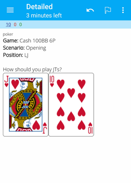
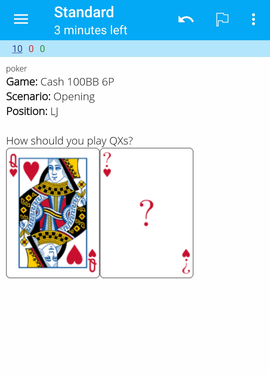
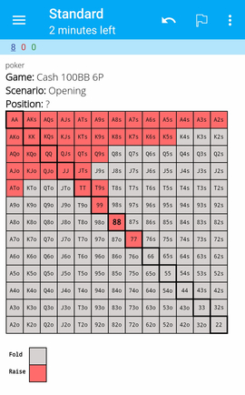
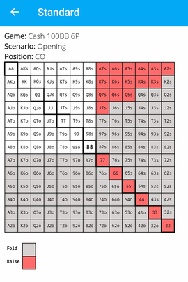
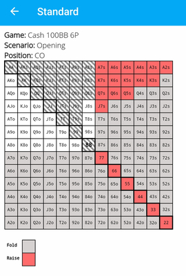
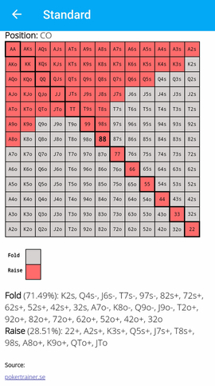

# AnkiPokerMaster

Python tool to generate one or multiple Anki decks for memorizing Texas Hold'em
Poker preflop ranges.

Anki is a powerful tool to learn and memorize useful information. It is
available for Windows, Linux, macOS, Android and iOS. [Official
website](https://apps.ankiweb.net/) and [inspiring
examples](https://augmentingcognition.com/ltm.html) of the power of Anki.

You can read some more about Poker preflop ranges
[here](https://www.splitsuit.com/poker-ranges-reading) and
[here](https://pokertrainer.se/preflop-introduction/).


## Usage

Write a YAML file to define all scenarios (situations) you want to memorize,
for example "Opening as Button in a 100BB Cash game". AnkiPokerMaster will
generate Anki decks based solely on this scenario.yml file and you will get
Anki cards like the screenshots below.

See an example for such a config file here:
[example_scenarios.yml](./example_scenarios.yml)

Execute `anki-poker-master --help` to see usage information.

### Screenshots

How should you play Jack and Ten suited?



How should you play Queen and any other suited card?



Memorize range tables first by remembering the correct position.



Memorize range tables by having 1/4 of the table blank and having to remember it.



You can mark the answer with the mouse or finger as a memory aid:



Solution side:



## Develop

```bash
poetry install
poetry run anki-poker-master
# poetry shell
```

## Tests

```bash
poetry run pytest
```

Most of the tests generate output that is compared with golden files (i.e.
files containing the expected output). This has the big advantage that you can
look at these files easily to see what the functions actually generate. Looking
at the HTML files in a browser gives you the full experience.

If you modify the code instead of having to manually fix all golden files you
can run the following command to overwrite them all. Obviously you should only
do this if you understand what you are changing.

```bash
poetry run pytest --update-golden
```

### Manual tests

Currently some tests are not automated because they would require programatically
evaluating Anki decks. For now doing it manually is simpler. The tests will
interactively guide you.

```bash
APM_MANUAL_TESTS=true poetry run pytest tests/test_manual.py -s
```

## Credits

### Playing Cards

Slightly modified from original source:

Vector Playing Cards 3.2  
https://totalnonsense.com/open-source-vector-playing-cards/  
Copyright 2011,2021 – Chris Aguilar – conjurenation@gmail.com  
Licensed under: LGPL 3.0 - https://www.gnu.org/licenses/lgpl-3.0.html
